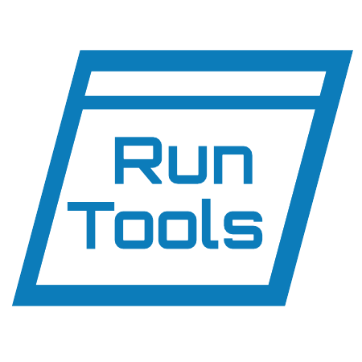

# Run-Tools

PowerShell tools for running processes with different privileges (Elevated/Not) from other user (Admin/Other) and more

[@Powershell_Gallery](https://www.powershellgallery.com/packages/Run-Tools/)

## License

This work is licensed under the terms of the MIT license.

For a copy, see: [LICENSE](LICENSE)

- site:    https://agramakov.me
- e-mail:  mail@agramakov.me

## Support

If you will decide to sopport me, you can send some pretty words on my email or just use the link

[Buy me a cup of tea](https://paypal.me/4ndr/1eur)

Any ammount will motivate me to develop the project. Thanks in advance!

## Todo

[Trello card](https://trello.com/c/tLkPD5DD/2-run-tools)
